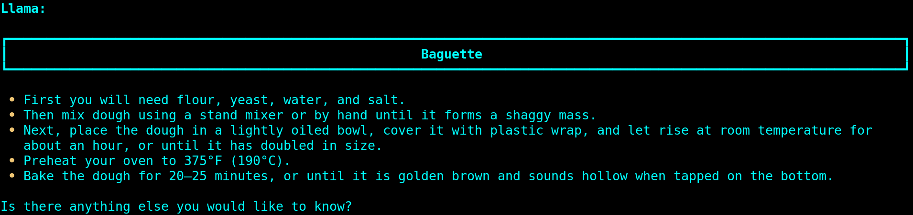
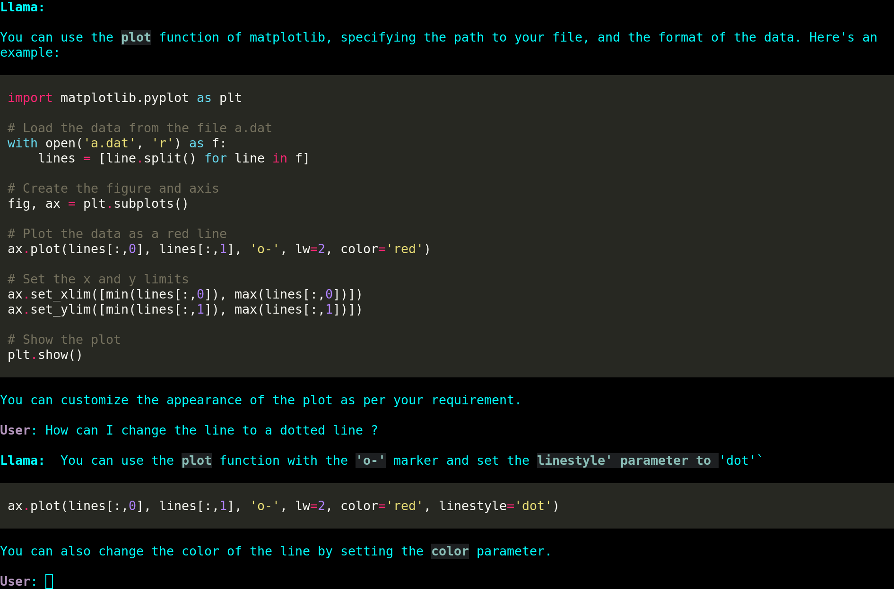

# clippy

A chat-like interface for running commands and interacting with the llama-cpp server.

## Features

* **streamed output**: text is displayed in realtime and reformated in markdown after
* **Markdown support**: Responses are displayed in markdown format, allowing for code highlighting and other formatting.
* **Piping**: Output can be piped to/from other commands for further processing.
* **Reading files**: You can read files into the chat interface for processing (using /read).
* **Custom personality**: Use a custom personality file to change the look and feel of the application.

## Get llama.cpp

See [llama.cpp](https://github.com/ggerganov/llama.cpp)

And start the server with:


```sh
# Depends on how you build llama we need the ./server binary
# alter -m to point to your model
./BUILD/bin/server -m ./models/13B/llama-2-13b-chat.ggmlv3.q8_0.bin -eps 1e-5
```

## Install

```sh
git clone https://github.com/besnardjb/clippy.git
cd clippy
pip install .
```

## Usage

**Default server URL is `http://127.0.0.1:8080`, use `-s` to alter**

To run the program, simply use the `cl` command followed by the desired command or text. 

For example:

```
$ cl how to cook baguette ?
```



You can run interactively using the `i` flag:

```
cl -i How make a plot with data from a file "a.dat" containing lines with "X Y" in mathplotlib using a red line ?
```




You can also pipe the output to other commands, like this:
```
$ cl -t list me cities of Europe as a JSON | tee out.json

Llama: Sure here you go!

[
"London",
"Paris",
"Berlin",
"Madrid",
"Rome",
"Barcelona",
"Amsterdam",
"Bergen"
]


And to see the help message and exit, use the `-h` option.
```


## Personality

To use a custom personality file, use the `--personality` option followed by the path to the file. For example:
```
cl --personality my_personality.txt
```


The default personality is:

```
You are llama a coding assisant.
You are here to make your best to answer questions from User.
You make structured responses (possibly with subparts with markdown headings) and try to highlight all possibilities while remaining concise.
You use as much markdown as possible in your answers as supported by commonmark.
When outputing code do not forget to put the right language in the MD syntax.
Never mention you use markdown just do it!
Never say things such as please note that the above response is just an example and not a real answer.
Do not infer what user would say.

User: Hello!
Llama: Hello dear user how can I help you ?
User: Give me some examples of native and interpreted languages
Llama:
# Native

- C : is a native language of reference
- C++ : add object oriented notation to C

## Interpreted

- Python: is a very popular language
- Perl: uses the same VM as python
```
